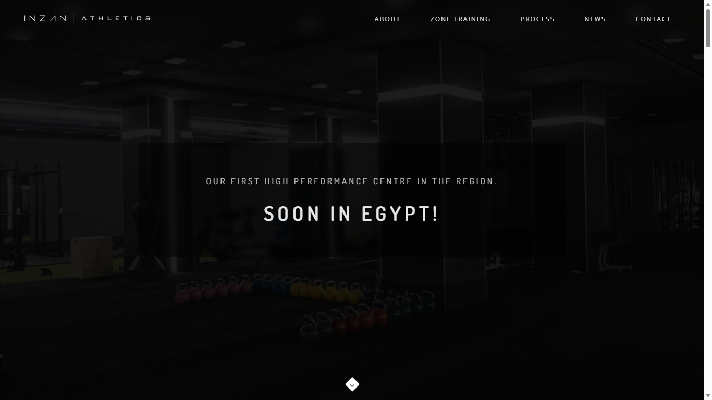
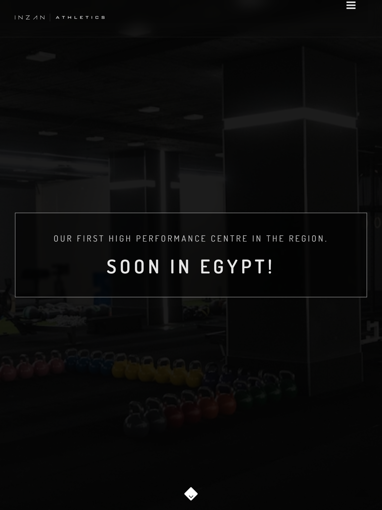
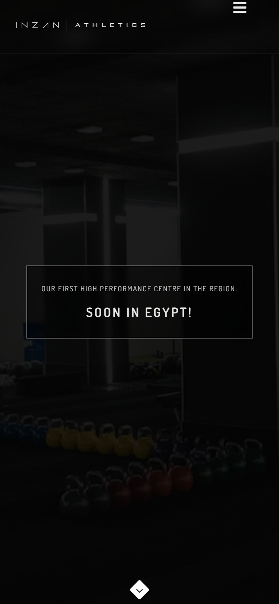

<p align="center">
  
</p>

<p align="center">
  <strong>Premier High Performance Training Centre & Commercial Gym Platform</strong>
</p>

<p align="center">
  <a href="https://inzan-athletics-430356395102.europe-west1.run.app"></a>
  
  
  
  
</p>

---

## 🌐 Live Deployment

- **Production URL**: [https://inzan-athletics-430356395102.europe-west1.run.app](https://inzan-athletics-430356395102.europe-west1.run.app)
- **Host**: Google Cloud Run (`europe-west1`)
- **Container**: Alpine NGINX with Gzip compression, 30-day static asset caching, and security headers.

---

## 📱 Multi-Device Visual Previews

| Desktop (1366x768) | Tablet (768x1024) | Mobile (390x844) |
|:------------------:|:-----------------:|:----------------:|
|  |  |  |

---

## 🏋️‍♂️ Project Overview

**Inzan Athletics** is an operating division of Inzan, a leading Canadian fitness consulting firm establishing high-performance fitness centres, nutrition outlets, and athletic development facilities in Egypt.

This repository contains the reconstructed commercial gym platform built with **1:1 fidelity** to the historical website archives, modernized with:
- **Strict Brand Design System**: Pure `#000000` base, `#1A1A1A` section backgrounds, `#2B2B2B` surface dividers, and `#383838` hover accents.
- **High-Resolution Official Branding**: Processed vector-crisp retina logo (`inzan-logo@2x.png`) with alpha transparency.
- **Fluid Responsiveness**: Engineered for seamless display across all screen sizes, from 390px mobile screens to large desktop monitors.
- **Interactive Enhancements**:
  - **Zone Training Lightbox**: Full-resolution modal viewer using Magnific Popup with custom-inpainted training floor photography.
  - **Dark Leaflet Map**: Replaced broken Google Maps API with a sleek CartoDB Dark Matter map centered on Garden 8, New Cairo &mdash; 100% watermark-free.
  - **Interactive News Reader**: Modal popups for reading full articles without leaving the page.
  - **Contact & Subscription Engine**: AJAX-driven form validation with accessible toast notifications.

---

## 🏛️ Section Architecture (1:1 Parity)

1. **Hero Section**: Framed glassmorphic box (*"OUR FIRST HIGH PERFORMANCE CENTRE IN THE REGION. SOON IN EGYPT!"*) with animated bouncing scroll chevron.
2. **Sticky Navigation Bar**: Local scrollspy navigation with retina logo, active-link indicators, and mobile drawer.
3. **What We Do**: 3-column science-based fitness consulting narrative and Canadian heritage.
4. **Where We Do It**: Centered facility narrative with sleek divider.
5. **Facility Slider**: Fullwidth carousel showcasing modern training floor environments.
6. **Zone Training (6 Disciplines)**:
   - Calisthenics
   - Powerlifting
   - Strongman
   - Olympic Lifting
   - Gymnastics
   - General Fitness
7. **How We Do It (12 Service Cards)**:
   - Strength & Conditioning
   - Inzan Athletics Coaching
   - Nutrition Consulting
   - Biomechanics & Video Analysis
   - Athletic Rehabilitation
   - Sports Medicine
   - High Altitude Training
   - Recovery & Regeneration
   - Testing & Assessment
   - Performance Mindset
   - Youth Athletic Development
   - Education & Certification
8. **Atmosphere Parallax Banner**: Motivational gym quote with high-contrast typography.
9. **Latest News**: Editorial cards with interactive modal reading experience.
10. **Newsletter**: Styled input with direct contact integration (`admin@inzanathletics.com`).
11. **Contact Section**: Phone (`+201000061243`), Address (`Garden 8, New Cairo, Egypt.`), Email (`admin@inzanathletics.com`), and validation-backed AJAX form.
12. **Collapsible Dark Map**: Leaflet + CartoDB Dark Matter tiles centered on Garden 8.
13. **Footer**: Official brand mark, social links, copyright, and division tagline (*"A DIVISION OF INZAN."*).

---

## 🎨 Color Palette & Design Tokens

```css
:root {
    --inzan-black:         #000000;  /* Base Background */
    --inzan-dark:          #1A1A1A;  /* Section & Card Dark */
    --inzan-surface:       #2B2B2B;  /* Surfaces & Dividers */
    --inzan-surface-hover: #383838;  /* Hover State */
    --inzan-white:         #FFFFFF;  /* Headings & Accents */
    --inzan-text-body:     #C4C4C4;  /* Body Typography */
    --inzan-text-muted:    #888888;  /* Captions & Subtitles */
}
```

---

## 💻 Local Development

### Option 1: Built-in Python Server
```bash
# Clone the repository
git clone https://github.com/michaelmagdy15/inzan-athletics.git
cd inzan-athletics

# Start local server
python -m http.server 8080
```
Open [http://localhost:8080](http://localhost:8080) in your browser.

### Option 2: Docker
```bash
# Build the container
docker build -t inzan-athletics .

# Run the container
docker run -d -p 8080:8080 inzan-athletics
```
Open [http://localhost:8080](http://localhost:8080).

---

## 🚀 Google Cloud Run Deployment

Deploy with a single command using `gcloud`:

```bash
gcloud run deploy inzan-athletics \
  --source . \
  --region europe-west1 \
  --allow-unauthenticated \
  --project bengarab
```

---

## 📄 License & Attribution

&copy; Inzan Athletics &mdash; A Division of INZAN. All Rights Reserved.
